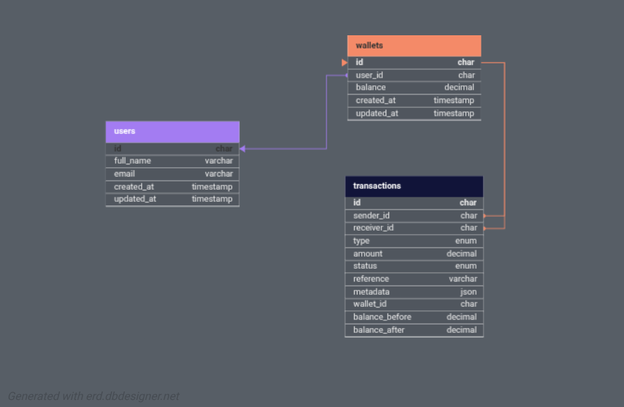

# Demo Credit Wallet Service

## Overview

Demo Credit is a mobile lending MVP wallet service built with **NodeJS**, **TypeScript**, **KnexJS**, and **MySQL**. It enables users to register, manage wallets, fund, withdraw, and transfer funds, with blacklist checks via the Lendsqr Adjutor Karma API.

---

## Features

- **User Registration & Login**  
  Faux token-based authentication for simplicity.
- **Wallet Management**  
  - Fund wallet  
  - Withdraw funds  
  - Transfer funds to other users
- **Transaction Handling**  
  All wallet operations are tracked as transactions.
- **Blacklist Integration**  
  Users on the Adjutor Karma blacklist cannot register.
- **Error Handling**  
  Custom error classes for robust error management.
- **Database Migrations**  
  Knex migrations for users, wallets, and transactions.
- **Middleware**  
  Authentication and user validation.
- **Utilities**  
  Body parsing, response formatting, and route parameter extraction.
- **Logging**  
  Winston-based logging for development and production.
- **Unit Tests**  
  Positive and negative scenarios for core features.

---

## Tech Stack

- **NodeJS (LTS)**
- **TypeScript**
- **KnexJS ORM**
- **MySQL**
- **Winston** (logging)
- **dotenv** (environment variables)

---

## Project Structure

```
src/
  config/         # DB and environment config
  database/
    migrations/   # Knex migration files
  errors/         # Custom error classes
  handlers/       # Route handlers (auth, wallet, transaction)
  middlewares/    # Authentication middleware
  repositories/   # Data access layer
  routes/         # API route definitions
  services/       # Business logic
  utils/          # Helpers (bodyParser, logger, etc.)
  knexfile.ts     # Knex config
  server.ts       # HTTP server entrypoint
.env              # Environment variables
```

---

## API Endpoints

| Method | Path                             | Description                   | Auth Required |
|--------|----------------------------------|-------------------------------|---------------|
| POST   | `/api/auth/register`             | Register a new user           | No            |
| POST   | `/api/auth/login`                | Login user                    | No            |
| GET    | `/api/users/me`                  | Get current user profile      | Yes           |
| GET    | `/api/wallets/me`                | Get current user's wallet     | Yes           |
| GET    | `/api/wallets/:walletId/balance` | Get a user's wallet balance   | Yes           |
| POST   | `/api/transactions/fund`         | Fund wallet                   | Yes           |
| POST   | `/api/transactions/withdraw`     | Withdraw from wallet          | Yes           |
| POST   | `/api/transactions/transfer`     | Transfer to another wallet    | Yes           |

**Authentication:**  
Use the returned `token` as a Bearer token in the `Authorization` header:  
`Authorization: Bearer fake-token-<userId>`

---

## Adjutor Karma Blacklist Integration

- On registration, the user's email is checked against the Adjutor Karma blacklist using the API key in `.env`.
- Blacklisted users are rejected with a relevant error.

---

## Database Design

See [`src/database/migrations/`](src/database/migrations/) for schema definitions.

### E-R Diagram

  
<!-- <iframe width="100%" height="500px" allowtransparency="true" allowfullscreen="true" scrolling="no" title="Embedded DB Designer IFrame" frameborder="0" src='https://erd.dbdesigner.net/designer/schema/1753697251-demo-credit?embed=true'></iframe> -->

---

## Environment Variables

See [`.env.example`](.env.example):

```
NODE_ENV=development
PORT=3300

DB_HOST=localhost
DB_PORT=3306
DB_USER=
DB_PASSWORD=
DB_NAME=demo_credit_db

ADJUTOR_API_KEY=...
```

---

## Running Locally

1. **Install dependencies:**
   ```sh
   pnpm install
   ```
2. **Set up `.env` file** (see above).
3. **Run migrations:**
   ```sh
   pnpm migrate:latest
   ```
4. **Start server:**
   ```sh
   pnpm dev
   ```

---

## Testing

Unit tests cover positive and negative scenarios for registration, wallet funding, withdrawal, and transfer.

Run tests:
```sh
pnpm test
```

---

## Postman Collection

A Postman collection is provided to help you test all API endpoints easily.

- **Download:** [Demo Credit Postman Collection](./Demo_Credit_API_Service.postman_collection.json)

**How to use:**
1. Import the collection into Postman.
2. Set up environment variables if needed (e.g., base URL, token).
3. Use the provided requests to test registration, login, wallet, and transaction endpoints.

---

## Deployment

Deployed at:  
`https://<candidate-name>-lendsqr-be-test.<cloud-platform-domain>`

---

## Design Decisions

- **Faux Token Auth:**  
  Simplifies authentication for MVP; tokens are generated as `fake-token-<userId>`.
- **Service Layer:**  
  Encapsulates business logic for maintainability.
- **Knex Transactions:**  
  Ensures atomicity for wallet transfers.
- **Custom Errors:**  
  Improves error reporting and handling.
- **Blacklist Check:**  
  Ensures compliance with Lendsqr requirements.

---

## Links

- **GitHub Repo:** [https://github.com/na-cho-dev/demo_credit](https://github.com/na-cho-dev/demo_credit)
- **Live API URL:** [https://demo-credit.up.railway.app](https://demo-credit.up.railway.app)
- **Design Document:** [Google Docs/Notion link]
- **Video Review:** [Loom link]


