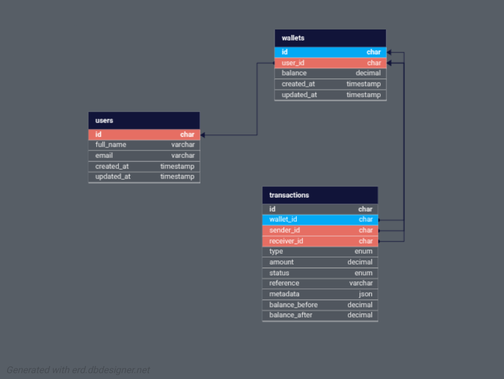

# Demo Credit Wallet Service

## Overview

Demo Credit is a mobile lending MVP wallet service built with **NodeJS**, **TypeScript**, **KnexJS**, and **MySQL**. It enables users to register, manage wallets, fund, withdraw, and transfer funds.

---

## Features

- **User Registration & Login**  
  Faux token-based authentication for simplicity.
- **Wallet Management**  
  - Fund wallet  
  - Withdraw funds  
  - Transfer funds to other users
- **Transaction Handling**  
  All wallet operations are tracked as transactions.
- **Error Handling**  
  Custom error classes for robust error management.
- **Database Migrations**  
  Knex migrations for users, wallets, and transactions.
- **Middleware**  
  Authentication and user validation.
- **Utilities**  
  Body parsing, response formatting, and route parameter extraction.
- **Logging**  
  Winston-based logging for development and production.
- **Unit Tests**  
  Positive and negative scenarios for core features.

---

## Tech Stack

- **Runtime**: Node.js
- **Language**: TypeScript
- **Database**: MySQL with Knex.js ORM
- **Logging**: Winston
- **Testing**: Jest
- **Code Quality**: ESLint + Prettier
- **Package Manager**: pnpm

<!-- - **NodeJS (LTS)**
- **TypeScript**
- **KnexJS ORM**
- **MySQL** (Database)
- **ESLint + Prettier** (Code Quality)
- **Winston** (Logging)
- **dotenv** (Environment Variables) -->

## Prerequisites

- Node.js (>=18.0.0)
- MySQL (>=8.0)
- pnpm (>=8.0.0)

---

## Installation

1. Clone the repository:
```bash
git clone <repository-url>
cd demo_credit
```

2. Install dependencies:
```bash
pnpm install
```

3. Set up environment variables:
```bash
cp .env.example .env
```

4. Configure your `.env` file:
```env
NODE_ENV=development
PORT=3300
HOST=localhost

# Database configuration
DB_HOST=localhost
DB_PORT=3306
DB_USER=your_mysql_username
DB_PASSWORD=your_mysql_password
DB_NAME=demo_credit_db

# API keys
```

5. Set up the database:
```bash
# Create database in MySQL
mysql -u root -p
CREATE DATABASE demo_credit_db;

# Run migrations
pnpm run migrate:latest
```

---

## Project Structure

```
src/
  config/         # DB and environment config
  database/
    migrations/   # Knex migration files
  errors/         # Custom error classes
  handlers/       # Route handlers (auth, wallet, transaction)
  middlewares/    # Authentication middleware
  repositories/   # Data access layer
  routes/         # API route definitions
  services/       # Business logic
  utils/          # Helpers (bodyParser, logger, etc.)
  knexfile.ts     # Knex config
  server.ts       # HTTP server entrypoint
.env              # Environment variables
```

---

## Development Scripts

### Core Development
```bash
# Start development server with hot reload
pnpm run dev

# Build for production
pnpm run build

# Start production server
pnpm run start
```

### Database Operations
```bash
# Create a new migration
pnpm run migrate:create <migration_name>

# Run latest migrations
pnpm run migrate:latest

# Rollback last migration
pnpm run migrate:rollback
```

### Code Quality & Testing
```bash
# Run ESLint (check and fix)
pnpm run lint

# Run ESLint (check only)
pnpm run lint:check

# Format code with Prettier
pnpm run format

# Check code formatting
pnpm run format:check

# Run tests
pnpm run test

# Run tests with coverage
pnpm run test:coverage

# Run all validation checks (lint + format + build + test)
pnpm run validate
```

## Code Quality

This project enforces code quality through:

- **ESLint**: Linting with TypeScript-specific rules
- **Prettier**: Consistent code formatting  
- **TypeScript**: Strong typing and compile-time checks
- **Jest**: Comprehensive testing framework
- **Husky**: Pre-commit hooks for quality gates

### Pre-commit Hooks

The project uses Husky with lint-staged to automatically:
- Run ESLint and fix issues
- Format code with Prettier
- Ensure code quality before commits

### Validation Pipeline

Before deploying or merging code, run:
```bash
pnpm run validate
```

This command runs:
1. ESLint checks (without auto-fix)
2. Prettier format validation
3. TypeScript compilation
4. Complete test suite

---

## API Endpoints

| Method | Path                             | Description                   | Auth Required |
|--------|----------------------------------|-------------------------------|---------------|
| POST   | `/api/auth/register`             | Register a new user           | No            |
| POST   | `/api/auth/login`                | Login user                    | No            |
| GET    | `/api/users/me`                  | Get current user profile      | Yes           |
| GET    | `/api/wallets/me`                | Get current user's wallet     | Yes           |
| GET    | `/api/wallets/:walletId/balance` | Get a user's wallet balance   | Yes           |
| POST   | `/api/transactions?limit=&page=` | View users transactions       | Yes           |
| POST   | `/api/transactions/fund`         | Fund wallet                   | Yes           |
| POST   | `/api/transactions/withdraw`     | Withdraw from wallet          | Yes           |
| POST   | `/api/transactions/transfer`     | Transfer to another wallet    | Yes           |

**Authentication:**  
Use the returned `token` as a Bearer token in the `Authorization` header:  
`Authorization: Bearer fake-token-<userId>`

---

## Request & Response Format

All API responses are in JSON format.

### Success Response

```json
{
  "success": true,
  "status": 200,
  "message": "Operation successful",
  "data": {
    // ...resource-specific fields
  }
}
```

**Example:**  
_Fetching current user wallet:_
```json
{
  "success": true,
  "status": 200,
  "message": "Wallet retrieved successfully",
  "data": {
    "id": "wallet-id",
    "user_id": "user-id",
    "balance": 1000,
    "created_at": "2024-08-02T10:00:00.000Z"
  }
}
```

---

### Error Response

```json
{
  "success": false,
  "status": 400,
  "error": "Error message describing what went wrong"
}
```

**Example:**  
_Attempting to withdraw more than balance:_
```json
{
  "success": false,
  "status": 400,
  "error": "Insufficient funds"
}
```

---

## Error Handling

- All errors return a consistent JSON structure with `success: false`, an HTTP status code, and an `error` message.
- Common error status codes:
  - `400` – Bad Request (validation errors, insufficient funds, etc.)
  - `401` – Unauthorized (missing or invalid token)
  - `403` – Forbidden (blacklisted user, forbidden action)
  - `404` – Not Found (resource does not exist)
  - `409` – Conflict (duplicate registration, etc.)
  - `500` – Internal Server Error (unexpected issues)

**Example Error Response:**
```json
{
  "success": false,
  "status": 401,
  "error": "Unauthorized: Missing token"
}
```

---

## Database Design

See [`src/database/migrations/`](src/database/migrations/) for schema definitions.

### E-R Diagram

  
<!-- <iframe width="100%" height="500px" allowtransparency="true" allowfullscreen="true" scrolling="no" title="Embedded DB Designer IFrame" frameborder="0" src='https://erd.dbdesigner.net/designer/schema/1753697251-demo-credit?embed=true'></iframe> -->

---

## Design Decisions

- **Faux Token Auth:**  
  Simplifies authentication for MVP; tokens are generated as `fake-token-<userId>`.
- **Service Layer:**  
  Encapsulates business logic for maintainability.
- **Knex Transactions:**  
  Ensures atomicity for wallet transfers.
- **Custom Errors:**  
  Improves error reporting and handling.

---

## Testing

The project uses Jest for testing with:
- Unit tests for services and utilities
- Integration tests for API endpoints
- Coverage reporting
- TypeScript support via ts-jest

```bash
# Run all tests
pnpm run test

# Run tests with coverage report
pnpm run test:coverage

# Run tests in watch mode
pnpm run test --watch
```

---

## Postman Collection

A Postman collection is provided to help you test all API endpoints easily.

- **Download:** [Demo Credit Postman Collection](./Demo_Credit_API_Service.postman_collection.json)
- **Or use online:** [Demo Credit API Service (Postman Cloud)](https://www.postman.com/nacho6/nacho-pws/collection/hs3sjuk/demo-credit-api-service?action=share&creator=38046602)

**How to use:**
1. Import the collection into Postman (or use the cloud link above).
2. Set up environment variables if needed (e.g., `base_url`, `token`).
3. Use the provided requests to test registration, login, wallet, and transaction endpoints.
4. Refer to the request descriptions for required fields and authentication details.

---

## Deployment

Deployed at:  
`https://democredit-nacho.up.railway.app`

---

## Contributing

1. Fork the repository
2. Create a feature branch
3. Make your changes
4. Run `pnpm run validate` to ensure code quality
5. Commit your changes (pre-commit hooks will run automatically)
6. Push to your branch
7. Create a Pull Request